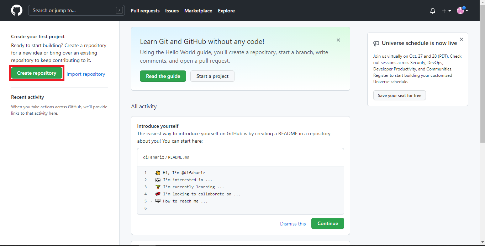
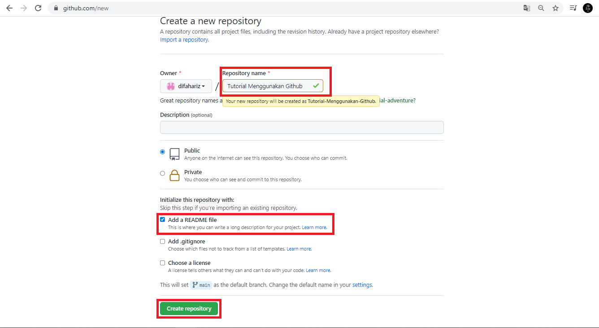
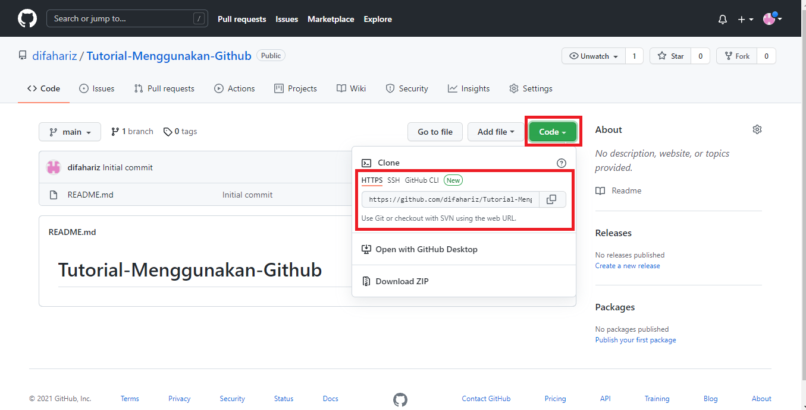
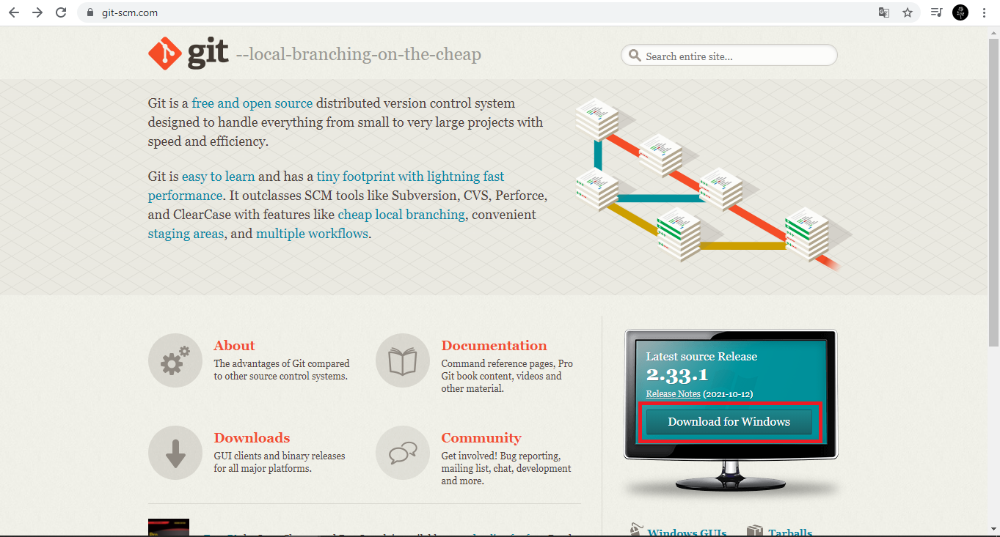
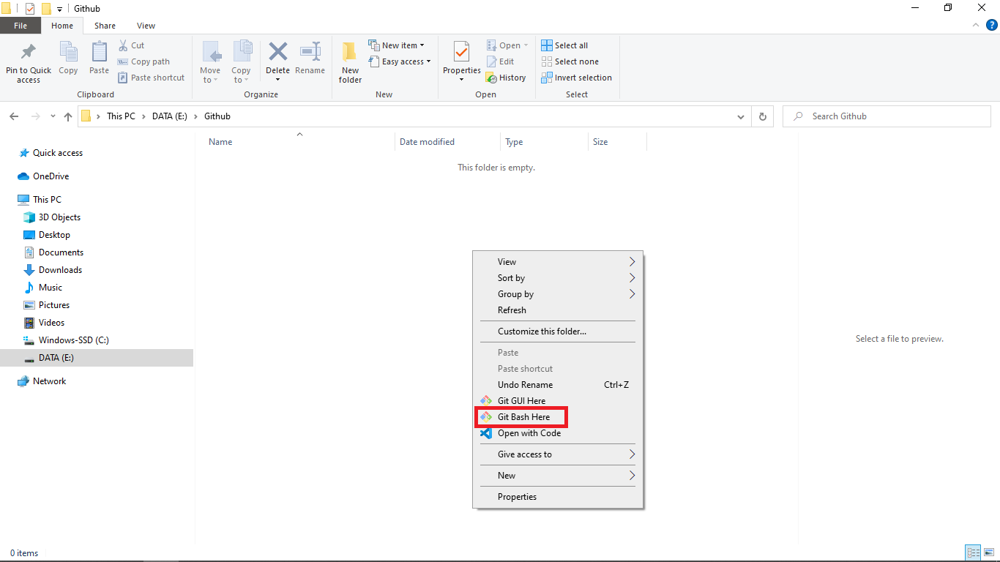
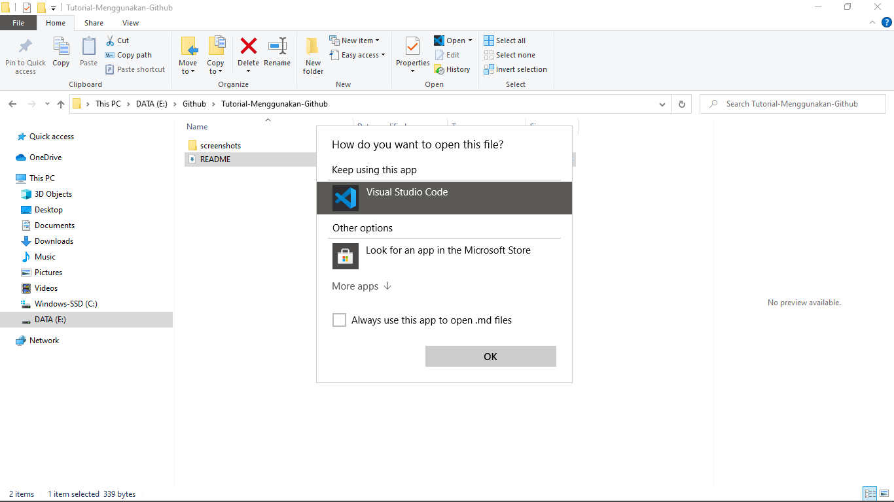
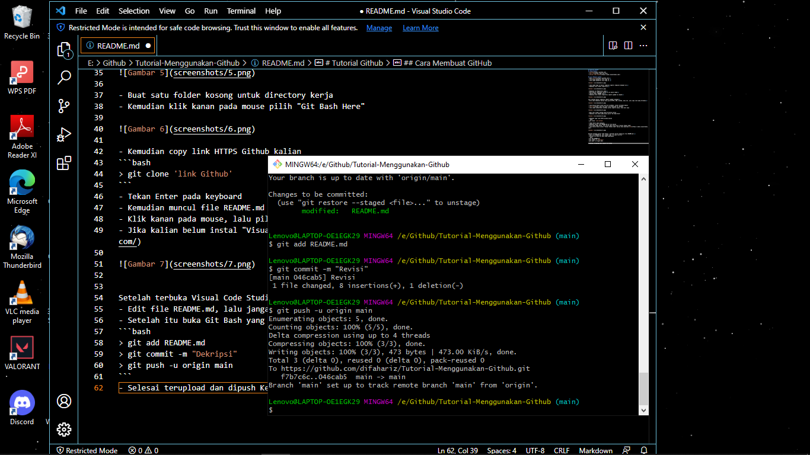

# Tutorial Github
## Requirements
- [GitHub](https://github.com)
- [Git-scm](https://git-scm.com/)
- [Visual Code Studio](https://code.visualstudio.com/)

## Cara Membuat GitHub
- Buka [GitHub](https://github.com)<p>
- Jika belum mendaftar klik Sign up <p>
- Jika sudah mendaftar klik Sign in <p>


- Jika sudah Sign in muncul tampilan seperti tampilan dibawah ini<p>
- Kemudian klik Create repository<p>



- Kemudian isi Repository name<p>
- Description (optional) boleh di isi boleh tidak<p>
- Ceklist Add a README file<p>
- Kemudian klik Create repository seperti gambar di bawah<p>



Lalu setelah muncul tampilan seperti gambar dibawah<p>
- Klik Code kemudian kalian bisa pilih HTTPS, SSH, Github, atau CLI. Lalu copy link yang tersedia<p>



- Jika kalian belum instal git-scm silahkan, instal terlebih dahulu
- [Git-scm](https://git-scm.com/) klik Download for Windows
- Jika sudah didownload silahkan instal seperti biasa, klik next saja



- Buat satu folder kosong untuk directory kerja
- Kemudian klik kanan pada mouse pilih "Git Bash Here"

 

- Kemudian copy link HTTPS Github kalian
```bash
> git clone 'link Github'
```
- Tekan Enter pada keyboard
- Kemudian muncul file README.md di file kalian
- Klik kanan pada mouse, lalu pilih open with pilih "Visual Studio Code"
- Jika kalian belum instal "Visual Studio Code" kalian bisa download [VCS](https://code.visualstudio.com/)

 


Setelah terbuka Visual Code Studio, pastikan kalian koding di file README.md</p>
- Edit file README.md, lalu jangan lupa  di save (ctrl+s)
- Setelah itu buka Git Bash yang sebelumnya
```bash
> git add README.md
> git commit -m "Dekripsi"
> git push -u origin main
```
- Selesai terupload dan dipush Ke Github

